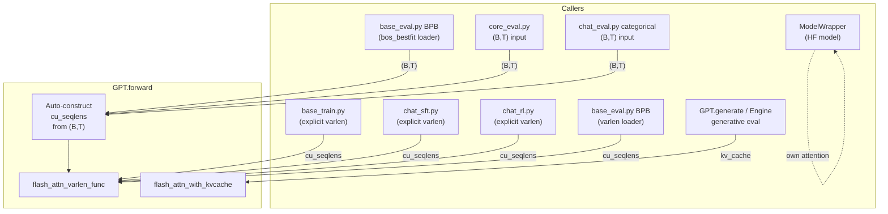

# Varlen Cleanup: Full Removal of Batched Attention

## Architecture after this change




**flash_attn_func is deleted.** All non-cached forward passes go through varlen. `(B, T)` callers that don't provide `cu_seqlens` get it auto-constructed in `GPT.forward`.

---

## Phase 1: Model core ([gpt.py](nanochat/nanochat/gpt.py) + [flash_attention.py](nanochat/nanochat/flash_attention.py))

### 1a. Auto-construct cu_seqlens in GPT.forward (line ~421)

When `cu_seqlens is None` and `kv_cache is None`, treat each row of `(B, T)` as a separate document:

```python
def forward(self, idx, targets=None, cu_seqlens=None, kv_cache=None, loss_reduction='mean'):
    if cu_seqlens is not None:
        # Explicit varlen: caller packed 1D tokens
        assert idx.ndim == 1
        idx = idx.unsqueeze(0)
        if targets is not None:
            targets = targets.unsqueeze(0)
        max_seq_len = self.config.sequence_len
    elif kv_cache is None:
        # Auto-construct: each row of (B, T) becomes a separate document
        B_orig, T_orig = idx.size()
        cu_seqlens = torch.arange(
            0, (B_orig + 1) * T_orig, T_orig,
            dtype=torch.int32, device=idx.device
        )
        max_seq_len = T_orig
        idx = idx.reshape(1, -1)
        if targets is not None:
            targets = targets.reshape(1, -1)
    else:
        max_seq_len = None

    B, T = idx.size()
    # ... rest unchanged, except pass max_seq_len through ...
```

This produces mathematically identical results to the old batched path: each row gets its own causal mask, rotary positions are offset but RoPE encodes relative positions so the attention patterns are equivalent. The smear gate bleeds across document boundaries exactly as it already does in explicit varlen training.

Update the `max_seq_len` assignment later in forward (line ~465) to use the computed `max_seq_len` variable instead of the current conditional.

Also reshape outputs back to the original `(B_orig, T_orig, ...)` shape before returning logits or computing loss.

### 1b. Remove batched branch from CausalSelfAttention.forward (line ~106)

Delete the `elif kv_cache is None` branch (lines 115-117) that calls `flash_attn.flash_attn_func`. Assert `cu_seqlens is not None` if `kv_cache is None`:

```python
if kv_cache is not None:
    # KV cache inference (unchanged)
    ...
else:
    # Varlen: packed 1D sequence with per-document attention isolation
    assert cu_seqlens is not None
    y = flash_attn.flash_attn_varlen_func(
        q[0], k[0], v[0],
        cu_seqlens_q=cu_seqlens, cu_seqlens_k=cu_seqlens,
        max_seqlen_q=max_seq_len, max_seqlen_k=max_seq_len,
        causal=True, window_size=window_size)
    y = y.unsqueeze(0)
```

### 1c. GPT.generate (line ~496)

No functional changes needed -- auto-construct handles it (B=1 single document). Add a `B=1` assertion for clarity:

```python
ids = torch.tensor([tokens], dtype=torch.long, device=device)
assert ids.size(0) == 1, "GPT.generate only supports batch size 1"
```

### 1d. Remove flash_attn_func from [flash_attention.py](nanochat/nanochat/flash_attention.py)

- Delete `flash_attn_func` function (lines 143-164)
- Remove from `SimpleNamespace` export (line 255)
- Update module docstring (lines 1-23) to reflect only two exported functions
- Keep `_sdpa_attention` (still used by `_sdpa_varlen_attention` and `flash_attn_with_kvcache` SDPA fallback)

---

## Phase 2: BPB evaluation ([base_eval.py](nanochat/scripts/base_eval.py))

Switch nanochat models to `tokenizing_distributed_data_loader_varlen` (line 273). Keep `bos_bestfit` for HuggingFace models:

```python
from nanochat.dataloader import tokenizing_distributed_data_loader_bos_bestfit, tokenizing_distributed_data_loader_varlen

# In BPB section:
if is_hf_model:
    loader = tokenizing_distributed_data_loader_bos_bestfit(...)
else:
    loader = tokenizing_distributed_data_loader_varlen(...)
```

[loss_eval.py](nanochat/nanochat/loss_eval.py) already supports 3-tuple `(x, y, cu_seqlens)` batches (line 33) -- no changes needed.

---

## Phase 3: SFT training ([chat_sft.py](nanochat/scripts/chat_sft.py))

### Convert sft_data_generator_bos_bestfit to varlen

Rewrite to pack conversations into a 1D buffer of `B*T+1` tokens with `cu_seqlens`:

- Greedy 1D packing (same pattern as the pretraining varlen dataloader)
- No conversation cropping -- if the next conversation doesn't fit, pad with BOS and mask
- `max_num_docs = ((total_tokens // 85) + 127) // 128 * 128` for `torch.compile` compatibility
- Loss mask applied in 1D: `targets[mask == 0] = -1`
- Pre-allocate all buffers once
- Yield `(inputs_1d, targets_1d, cu_seqlens)` instead of `(inputs, targets)`
- Preserve `last_step`, `approx_progress`, `current_epoch` semantics

### Update training loop

- Line 331: `x, y = next(train_loader)` --> `x, y, cu_seqlens = next(train_loader)`
- Line 433: `loss = model(x, y)` --> `loss = model(x, y, cu_seqlens=cu_seqlens)`
- Line 440: same pattern for micro-step prefetch
- Val loader: also yield 3-tuples. `evaluate_bpb` already handles them.

---

## Phase 4: RL training ([chat_rl.py](nanochat/scripts/chat_rl.py))

### Convert get_batch (line ~86) to produce varlen

Currently: pad sequences to `(B, T)`, yield `(sequences, inputs, targets, rewards, advantages)`.

Change to:

1. Pack the B rollout sequences into a 1D buffer with `cu_seqlens`
2. Apply target mask in 1D (`targets[mask == 0] = -1`)
3. Yield `(sequences, inputs_1d, targets_1d, cu_seqlens, rewards, advantages)`

### Update training pass (lines ~256-273)

Currently:

```python
inputs = inputs_all[b0:b1]
targets = targets_all[b0:b1]
logp = -model(inputs, targets, loss_reduction='none').view_as(inputs)
pg_obj = (logp * advantages.unsqueeze(-1)).sum()
```

Change to:

- Slice packed sequences by cu_seqlens instead of by rows
- `logp = -model(inputs_1d, targets_1d, cu_seqlens=cu_seqlens, loss_reduction='none')`
- Map per-sequence advantages to per-token positions using cu_seqlens boundaries:

```python
# Expand per-sequence advantages to per-token
token_advantages = torch.zeros_like(logp)
for i in range(num_seqs):
    start, end = cu_seqlens[i].item(), cu_seqlens[i+1].item()
    token_advantages[start:end] = advantages[i]
pg_obj = (logp * token_advantages).sum()
```

Note: the sub-batching loop (`num_passes`) needs rethinking since we can't slice rows from a 1D buffer. Options:

- Pack only `device_batch_size` sequences per varlen batch, loop over multiple varlen batches
- Or pack all sequences but slice `cu_seqlens` windows for each micro-batch

The first option is simpler and matches the existing loop structure.

---

## Phase 5: No-change zones (auto-construct handles these)

### CORE evaluation ([core_eval.py](nanochat/nanochat/core_eval.py))

- `forward_model` passes `(B, T)` to `model(input_ids)` -- auto-construct handles it
- `stack_sequences`, `batch_sequences_mc/schema/lm`, `evaluate_example`, `evaluate_task`: **no changes**
- For HuggingFace models via `ModelWrapper`: uses HF's own attention, completely unaffected

### Chat categorical eval ([chat_eval.py](nanochat/scripts/chat_eval.py))

- `run_categorical_eval` calls `model(prompt_ids)` with `(B, T)` -- auto-construct handles it
- **No changes needed**

### Chat generative eval

- Uses `Engine.generate` --> KV cache path -- **no changes needed**

### GPT.generate

- Uses `self.forward(ids)` with `(1, T)` -- auto-construct creates trivial single-document cu_seqlens
- **No functional changes** (just add B=1 assert)

### ModelWrapper ([base_eval.py](nanochat/scripts/base_eval.py) line 45)

- Wraps HuggingFace models, calls `self.model(input_ids).logits` -- never touches nanochat's attention
- **No changes needed**

---

## Phase 6: Tests and cleanup

### [test_attention_fallback.py](nanochat/tests/test_attention_fallback.py)

- All `TestFA3VsSDPA` tests use `flash_attn.flash_attn_func` -- convert to `flash_attn.flash_attn_varlen_func`
- `test_backward_gradients_match`: convert to varlen
- Keep `flash_attn_with_kvcache` tests unchanged
- `TestSDPAOnly.test_basic_forward` and `test_backward`: convert from `flash_attn_func` to `flash_attn_varlen_func`

### Comments and docstrings

- [flash_attention.py](nanochat/nanochat/flash_attention.py): update module docstring to remove `flash_attn_func` usage example
- [gpt.py](nanochat/nanochat/gpt.py): update comment in CausalSelfAttention to reflect two-path architecture
- [dataloader.py](nanochat/nanochat/dataloader.py): update module docstring to note varlen is the primary path; bos_bestfit is HF-model-only

